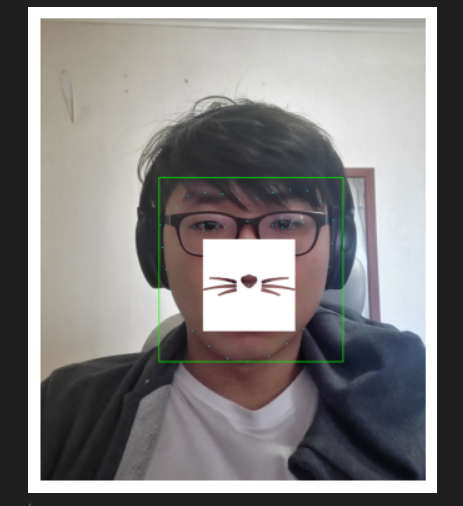
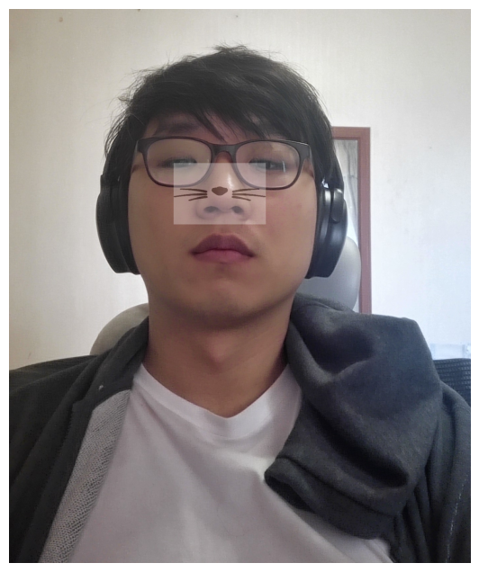
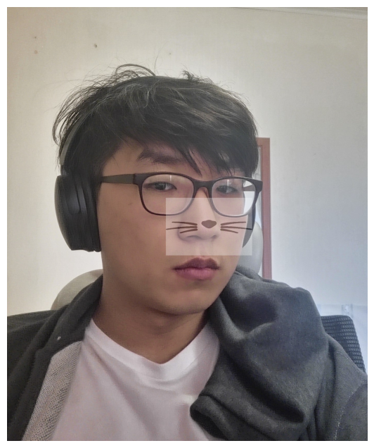
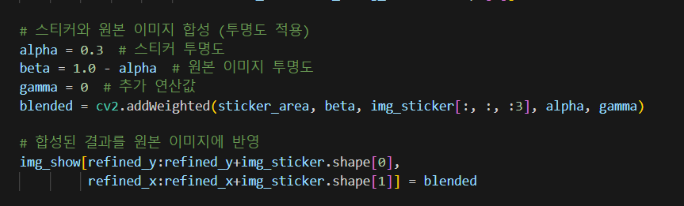
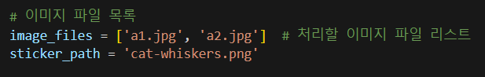
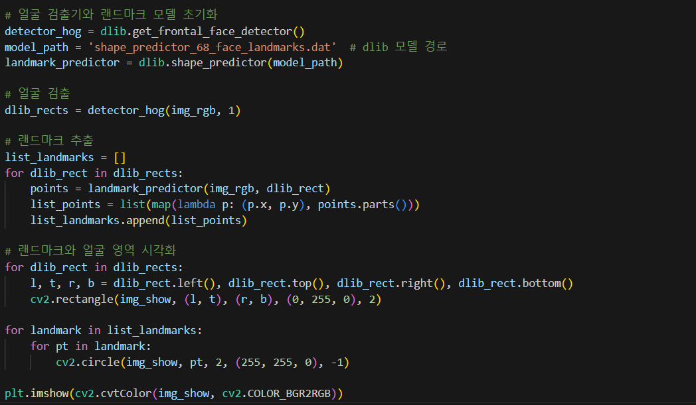

# AIFFEL Campus Online Code Peer Review Templete
- 코더 : 조현철
- 리뷰어 : 손병진


# PRT(Peer Review Template)
- [x]  **1. 주어진 문제를 해결하는 완성된 코드가 제출되었나요?**
    - 1. 얼굴 영역과 랜드마크를 정확하게 검출하고, 스티커 사진 합성시키는 데 성공하였다.
        - 라운딩 박스와 랜드마크를 정확하게 검출하고 사진 합성.
        
        

    - 2. 정확한 좌표계산을 통해 고양이 수염의 위치가 원본 얼굴에 잘 어울리게 출력되었다.
        - 수염 위치는 코 끝에 위치시켜 얼굴과 잘 어울리게 세팅.
        

    - 3. 얼굴 각도 등 다양한 변수에 따른 영향도 분석
        - 위아래, 좌우 각도에 따른 얼굴인식 테스트
        
        
    
- [x]  **2. 전체 코드에서 가장 핵심적이거나 가장 복잡하고 이해하기 어려운 부분에 작성된 
주석 또는 doc string을 보고 해당 코드가 잘 이해되었나요?**
    - png의 알파채널을 활용해서 투명도를 설정하는 부분이 인상깊었음
        
        
- [x]  **3. 에러가 난 부분을 디버깅하여 문제를 해결한 기록을 남겼거나
새로운 시도 또는 추가 실험을 수행해봤나요?**
    - 다양한 실험을 위해 직접 사진을 추가로 찍어서 활용함
        
        
- [ ]  **4. 회고를 잘 작성했나요?**
    - 주어진 문제를 해결하는 완성된 코드 내지 프로젝트 결과물에 대해
    배운점과 아쉬운점, 느낀점 등이 기록되어 있는지 확인
    - 전체 코드 실행 플로우를 그래프로 그려서 이해를 돕고 있는지 확인
        - 중요! 잘 작성되었다고 생각되는 부분을 캡쳐해 근거로 첨부
        
- [x]  **5. 코드가 간결하고 효율적인가요?**
    - 코드마다 주석이 잘 달려있으며 간결하고 누가봐도 이해될수 있도록 코드 구현함.
        


# 회고(참고 링크 및 코드 개선)
```
# 리뷰어의 회고를 작성합니다.
# 코드 리뷰 시 참고한 링크가 있다면 링크와 간략한 설명을 첨부합니다.
# 코드 리뷰를 통해 개선한 코드가 있다면 코드와 간략한 설명을 첨부합니다.
```
