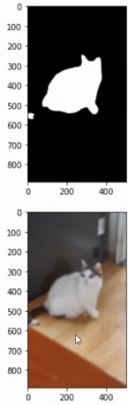

# AIFFEL Campus Online Code Peer Review Templete
- 코더 : 코더의 이름을 작성하세요.
- 리뷰어 : 리뷰어의 이름을 작성하세요.


# PRT(Peer Review Template)
- [X]  **1. 주어진 문제를 해결하는 완성된 코드가 제출되었나요?**
        
        
        

    
- [X]  **2. 전체 코드에서 가장 핵심적이거나 가장 복잡하고 이해하기 어려운 부분에 작성된 
주석 또는 doc string을 보고 해당 코드가 잘 이해되었나요?**
    - 주석이 적절히 작성되어 있습니다.
        
- [X]  **3. 에러가 난 부분을 디버깅하여 문제를 해결한 기록을 남겼거나
새로운 시도 또는 추가 실험을 수행해봤나요?**
    - 문제 원인 및 해결 과정을 잘 기록하였는지 확인
    - 프로젝트 평가 기준에 더해 추가적으로 수행한 나만의 시도, 
    실험이 기록되어 있는지 확인
    
    발생한 문제 관찰하여 원인 파악후 개선 방향에 대한 아이디어를 잘 포함하였습니다. 
- [X]  **4. 회고를 잘 작성했나요?**
    
    프로젝트에 대한 회고를 잘 작성하였습니다.

- [X]  **5. 코드가 간결하고 효율적인가요?**
    - 코드는 작동에 문제 없이 잘 작성되었습니다.

# 회고(참고 링크 및 코드 개선)
```
깊이에 따른 블러 강도의 가변적 적용은 심도 문제를 실제로 해결하고자 할 때 좋은 방법인 것 같습니다.
```
