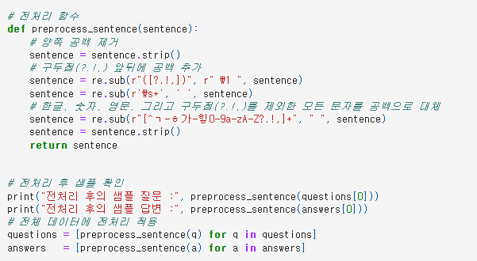
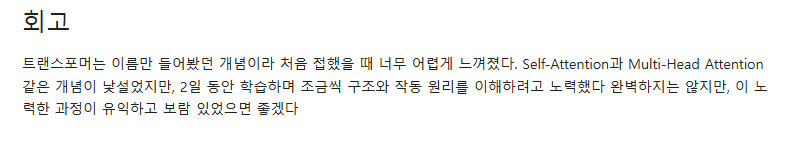
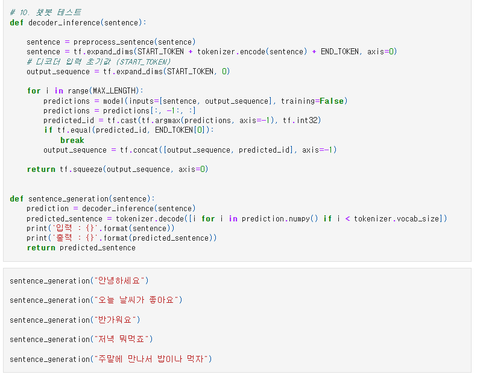

# AIFFEL Campus Online Code Peer Review Templete
- 코더 : 조현철
- 리뷰어 : 염철헌


# PRT(Peer Review Template)
- [X]  **1. 주어진 문제를 해결하는 완성된 코드가 제출되었나요?**
    - 문제에서 요구하는 최종 결과물이 첨부되었는지 확인
        - 중요! 해당 조건을 만족하는 부분을 캡쳐해 근거로 첨부
        - sentence generation 까지 성공적으로 수행했고, 5개의 문장을 출력하였음
        - 
    
- [X]  **2. 전체 코드에서 가장 핵심적이거나 가장 복잡하고 이해하기 어려운 부분에 작성된 
주석 또는 doc string을 보고 해당 코드가 잘 이해되었나요?**
    - 해당 코드 블럭을 왜 핵심적이라고 생각하는지 확인
    - 해당 코드 블럭에 doc string/annotation이 달려 있는지 확인
    - 해당 코드의 기능, 존재 이유, 작동 원리 등을 기술했는지 확인
    - 주석을 보고 코드 이해가 잘 되었는지 확인
        - 중요! 잘 작성되었다고 생각되는 부분을 캡쳐해 근거로 첨부
        - 트랜스포머에 필요한 부분을 모듈 함수로 정의하고 최종적으로 잘 연결하여 완성된 구조를 만듬
        - 
        
- [ ]  **3. 에러가 난 부분을 디버깅하여 문제를 해결한 기록을 남겼거나
새로운 시도 또는 추가 실험을 수행해봤나요?**
    - 문제 원인 및 해결 과정을 잘 기록하였는지 확인
    - 프로젝트 평가 기준에 더해 추가적으로 수행한 나만의 시도, 
    실험이 기록되어 있는지 확인
        - 중요! 잘 작성되었다고 생각되는 부분을 캡쳐해 근거로 첨부
        - 추가적인 실험이나 하이퍼파라미터 조정은 수행하지 않았지만, 한국어 전처리에 맞게 조건식에 한글 문자를 추가하는 등의 변경을 거쳤음
        - 
        
- [X]  **4. 회고를 잘 작성했나요?**
    - 주어진 문제를 해결하는 완성된 코드 내지 프로젝트 결과물에 대해
    배운점과 아쉬운점, 느낀점 등이 기록되어 있는지 확인
    - 전체 코드 실행 플로우를 그래프로 그려서 이해를 돕고 있는지 확인
        - 중요! 잘 작성되었다고 생각되는 부분을 캡쳐해 근거로 첨부
        - 회고를 통해 트랜스포머에 대한 낯설음을 잘 기록했으며, 여러 방면으로 이해하려고 노력했음을 PR 과정에서 파악하였음
        - 
        
- [X]  **5. 코드가 간결하고 효율적인가요?**
    - 파이썬 스타일 가이드 (PEP8) 를 준수하였는지 확인
    - 코드 중복을 최소화하고 범용적으로 사용할 수 있도록 함수화/모듈화했는지 확인
        - 중요! 잘 작성되었다고 생각되는 부분을 캡쳐해 근거로 첨부
        - 전체적으로 학습 노드의 코드를 잘 구현하였고, 코드 이해가 떨어지는 부분은 없음
        - 


# 회고(참고 링크 및 코드 개선)
```
# 전체적으로 트랜스포머 구조 이해에 오랜 시간이 걸려 시각화, 추가 실험 등의 태스크가 부족한 부분은 있으나, 코드 구현에서 문제가 있지는 않았고 파인튜닝이나 추가적인 전처리를 통해서 성능 개선이 될 것으로 생각됩니다.
```
