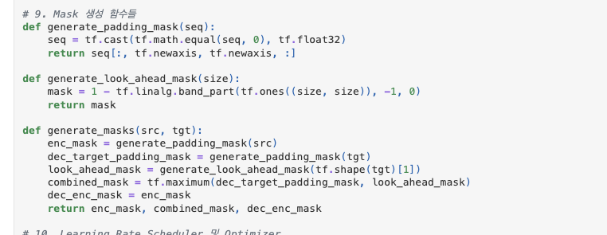
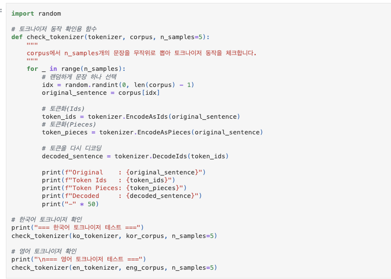
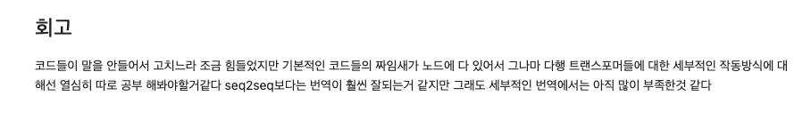
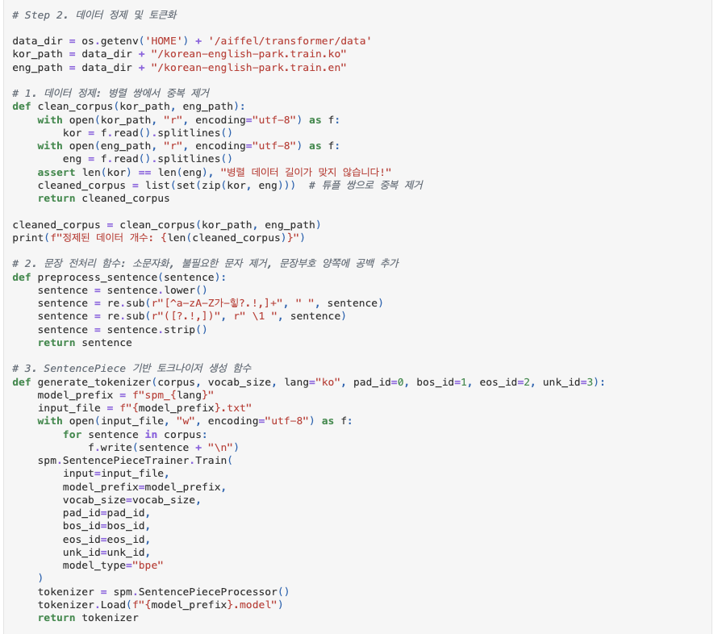

# AIFFEL Campus Online Code Peer Review Templete
- 코더 : 조 현철
- 리뷰어 : 김 영만


# PRT(Peer Review Template)
- [*]  **1. 주어진 문제를 해결하는 완성된 코드가 제출되었나요?**
    - 번역과 Attention Map이 출력 되었습니다.
        - ![done[(./done.png)
        - ![done1[(./done1.png)
    
- [*]  **2. 전체 코드에서 가장 핵심적이거나 가장 복잡하고 이해하기 어려운 부분에 작성된 
주석 또는 doc string을 보고 해당 코드가 잘 이해되었나요?**
    - 컴파인 마스크를 사용하여 출력물의 결과를 높였습니다.
      - 
        
- [*]  **3. 에러가 난 부분을 디버깅하여 문제를 해결한 기록을 남겼거나
새로운 시도 또는 추가 실험을 수행해봤나요?**
    - 토큰화에 대한 값 체크가 수행 되었습니다.
      - 
        
- [*]  **4. 회고를 잘 작성했나요?**
    - 작업에 대한 전체적인 과정과 앞으로 해야 할 일에 대해 잘 기술 되어있습니다.
      - 
        
- [*]  **5. 코드가 간결하고 효율적인가요?**
    - 함수 정의가 잘 되어있습니다.
      - 
        


# 회고(참고 링크 및 코드 개선)
```
심플한 프로젝트의 완성 후 학습해야 할 내용에 대한 회고가 인상적입니다.
수고 많이 하셨습니다.
```
