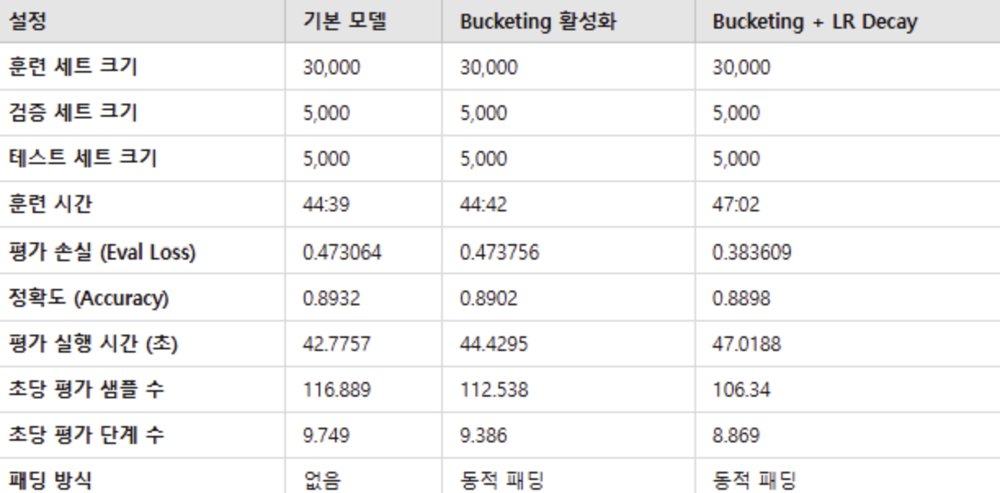
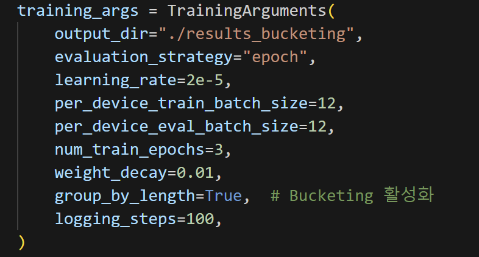
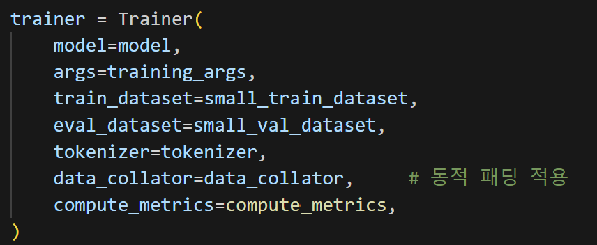
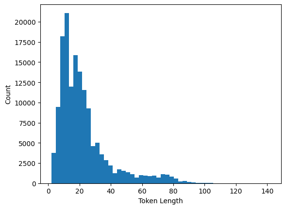
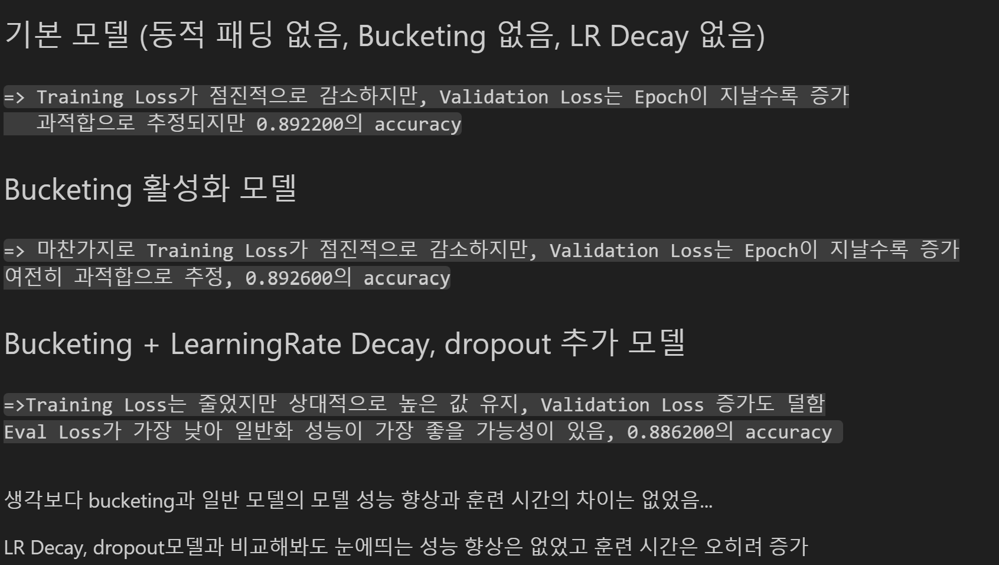
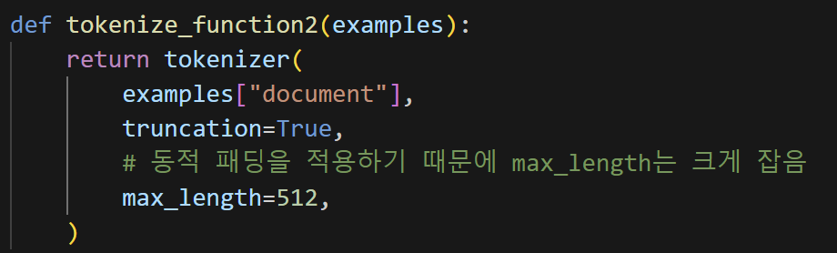

# AIFFEL Campus Online Code Peer Review Templete
- 코더 : 조현철
- 리뷰어 : 손병진

# PRT(Peer Review Template)
- [x]  **1. 주어진 문제를 해결하는 완성된 코드가 제출되었나요?**
    - 프로젝트 목표로 맞게 여러 파라미터 수정해가며 실험 진행 및 결과 도출.
        
    
- [x]  **2. 전체 코드에서 가장 핵심적이거나 가장 복잡하고 이해하기 어려운 부분에 작성된 
주석 또는 doc string을 보고 해당 코드가 잘 이해되었나요?**
    - 추가되거나 변경된 코드마다 주석을 달아 수정된 부분을 명확히 알 수 있음.
        
        
        
- [x]  **3. 에러가 난 부분을 디버깅하여 문제를 해결한 기록을 남겼거나
새로운 시도 또는 추가 실험을 수행해봤나요?**
    - 동적 패딩이 정상적으로 작동되지않는 문제점을 해결하기 위해 데이터 길이 분포를 찍어보는 등의 노력함.
        
        
- [x]  **4. 회고를 잘 작성했나요?**
    - 프로젝트 결과에 대하여 정리하고 본인의 생각을 기록함.
        
        
- [x]  **5. 코드가 간결하고 효율적인가요?**
    - 코드를 함수로 관리하여 코드 재사용성과 효율성을 높임.
        

# 회고(참고 링크 및 코드 개선)
- 동적패딩 부분 토크나이저 진행할때 padding 부분을 삭제하고 진행하면 정상적으로 동적패딩이 진행되었는데, 현철님 코드 다시 살펴보니 padding 부분 삭제가 되어있어서 왜 동적패딩이 정상적으로 진행되지않았을까 같이 고민해보겠습니다.
- 실험 변수들을 표로 만들어 정리해둔 부분과 텍스트 분포를 확인하면서 동적패딩문제 해결방법을 고민해본 부분이 인상깊었습니다.
